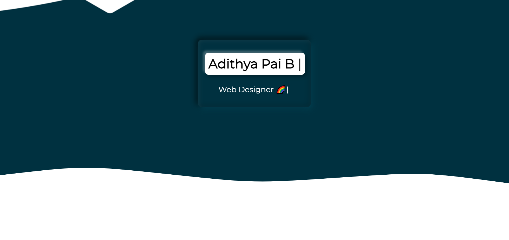
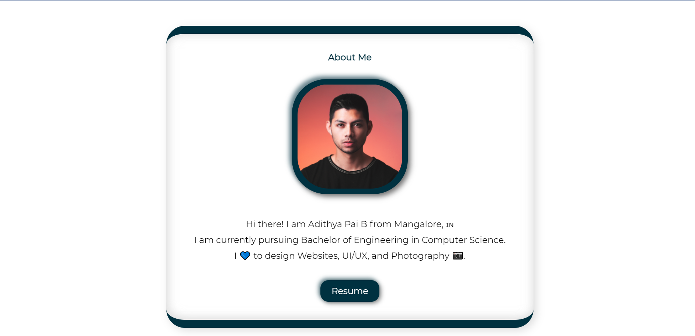
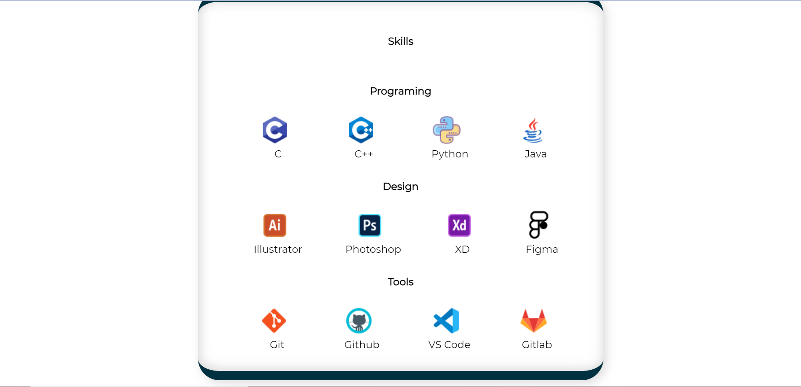
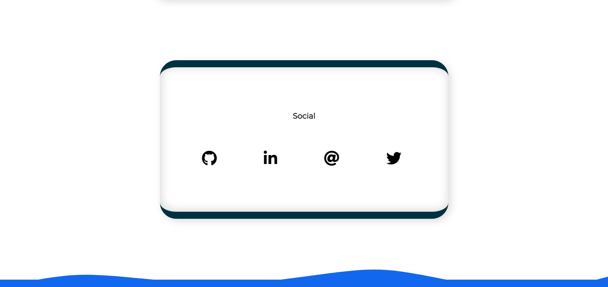

## Portfolio Template for beginners 
This is a OpenSource Portfolio Template Based on Neomorphic Theme Made with pure HTML, CSS(SCSS), And A bit of Java script

[LIVE LINK](https://adithyapaib.github.io/portfolio-template/)

# :handshake: Our Contributors 

### Template Preview

     
     
